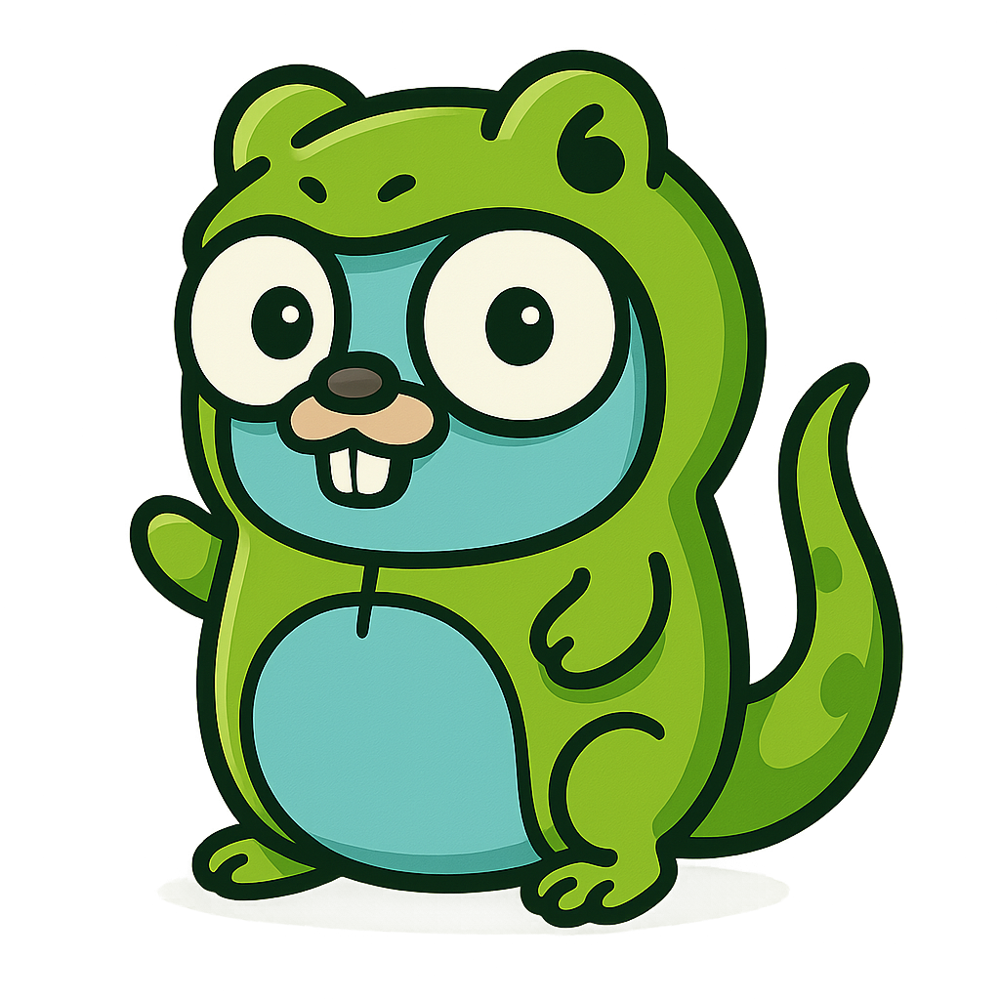

# Goingecko

<p align="center">
    
</p> 

Goingecko is a Go client library for the CoinGecko API that provides easy access to cryptocurrency data. It supports both the public and Pro API endpoints, with features like rate limiting and automatic retries. The library is designed to be simple to use while providing comprehensive access to CoinGecko's cryptocurrency data services.

Key features:
- Support for both public and Pro API endpoints
- Separate WebSocket client for paid CoinGecko plans
- Rate limiting with configurable request limits
- Automatic retry with exponential backoff
- Comprehensive endpoint coverage
- Type-safe API responses
- Context support for request cancellation and timeouts


## Endpoints

### Simple Endpoints
| Endpoint                                                   |  Status | Function                  | Plan |
|------------------------------------------------------------|--|---------------------------|------|
| /ping                                                      | ✓ | Ping                      | 🦎 |
| /simple/price                                              | ✓ | SimplePrice               | 🦎 |
| /simple/token_price/{id}                                   | ✓ | SimpleTokenPrice          | 🦎 |
| /simple/supported_vs_currencies                            | ✓ | SimpleSupportedVsCurrency | 🦎 |

### Coins Endpoints
| Endpoint                                 |  Status | Function                | Plan |
|------------------------------------------|--|-------------------------|----|
| /coins/list                              | ✓ | CoinsList               | 🦎 |
| /coins/top_gainers_losers                | ✓ | CoinsTopGainersLosers   | 💼 |
| /coins/list/new                          | ✓ | CoinsListNew            | 💼 |
| /coins/markets                           | ✓ | CoinsMarket             | 🦎 |
| /coins/{id}                              | ✓ | CoinsId                 | 🦎 |
| /coins/{id}/tickers                      | ✓ | CoinsIdTickers          | 🦎 |
| /coins/{id}/history                      | ✓ | CoinsIdHistory          | 🦎 |
| /coins/{id}/market_chart                 | ✓ | CoinsIdMarketChart      | 🦎 |
| /coins/{id}/market_chart/range           | ✓ | CoinsIdMarketChartRange | 🦎 |
| /coins/{id}/ohlc                         | ✓ | CoinsOhlc               | 🦎 | 
| /coins/{id}/supply_breakdown             | ✓ | CoinsIdSupplyBreakdown  | 💼 |
| /coins/{id}/ohlc/range                   | ✓ | CoinsOhlcRange          | 💼 |
| /coins/{id}/circulating_supply_chart     | ✓ | CoinsIdCirculatingSupplyChart | 👑 |
| /coins/{id}/circulating_supply_chart/range | ✓ | CoinsIdCirculatingSupplyChartRange | 👑 |
| /coins/{id}/total_supply_chart           | ✓ | CoinsIdTotalSupplyChart | 👑 |
| /coins/{id}/total_supply_chart/range     | ✓ | CoinsIdTotalSupplyChartRange | 👑 |

### Contract Endpoints
| Endpoint                                                   |  Status | Function                  | Plan |
|------------------------------------------------------------|--|---------------------------|------|
| /coins/{id}/contract/{contract_address}                    | ✓ | ContractInfo              | 🦎 |
| /coins/{id}/contract/{contract_address}/market_chart/      | ✓ | ContractMarketChart       | 🦎 |
| /coins/{id}/contract/{contract_address}/market_chart/range | ✓ | ContractMarketChartRange  | 🦎 |

### Categories Endpoints
| Endpoint                                                   |  Status | Function                  | Plan |
|------------------------------------------------------------|--|---------------------------|------|
| /coins/categories/list                                     | ✓ | CategoriesList            | 🦎 |
| /coins/categories/                                         | ✓ | Categories                | 🦎 |

### Exchange Endpoints
| Endpoint                               |  Status | Function               | Plan |
|----------------------------------------|--|------------------------|------|
| /exchanges                             | ✓ | Exchanges              | 🦎 |
| /exchanges/list                        | ✓ | ExchangesList          | 🦎 |
| /exchanges/{id}                        | ✓ | ExchangesId            | 🦎 |
| /exchanges/{id}/tickers                | ✓ | ExchangesIdTickers     | 🦎 |
| /exchanges/{id}/volume_chart           | ✓ | ExchangesIdVolumeChart | 🦎 |
| /exchanges/{id}/volume_chart/range     | ✓ | ExchangesIdVolumeChartRange | 💼 |

### Derivatives Endpoints
| Endpoint                                                   |  Status | Function                  | Plan |
|------------------------------------------------------------|--|---------------------------|------|
| /derivaties                                                | ✓ | Derivatives               | 🦎 |
| /derivaties/exchanges                                      | ✓ | DerivativesExchanges      | 🦎 |
| /derivaties/exchanges/{id}                                 | ✓ | DerivativesExchangesId    | 🦎 |
| /derivaties/exchanges/list                                 | ✓ | DerivativesExchangesList  | 🦎 |

### NFT Endpoints
| Endpoint                                                       |  Status | Function     | Plan |
|----------------------------------------------------------------|--|--------------|------|
| /nfts/list                                                     | ✓ | NftsList     | 🦎 |
| /nfts/{id}                                                     | ✓ | NftsId       | 🦎 |
| /nfts/{asset_platform_id}/contract/{contract_address}          | ✓ | NftsContract | 🦎 |
| /nfts/markets                                                  | ✓ | NftsMarkets  | 💼 |
| /nfts/{id}/market_chart                                        | ✓ | NftsIdMarketChart | 💼 |
| /nfts/{asset_platform_id}/contract/{contract_address}/market_chart | ✓ | NftsContractMarketChart | 💼 |
| /nfts/{id}/tickers                                             | ✓ | NftsIdTickers | 💼 |

### Public Treasury Endpoints
| Endpoint                                                       |  Status | Function     | Plan |
|----------------------------------------------------------------|--|--------------|------|
| /entities/list                          | ✓ | EntitiesList             | 🦎 |
| /{entity}/public_treasury/{coin_id}      | ✓ | PublicTreasuryCoinIdByEntity | 🦎 |
| /public_treasury/{entity_id}             | ✓ | PublicTreasuryEntity     | 🦎 |
| /public_treasury/{entity_id}/{coin_id}/holding_chart | ✓ | PublicTreasuryHoldingChart | 🦎 |
| /public_treasury/{entity_id}/transaction_history | ✓ | PublicTreasuryTransactionHistory | 🦎 |

### Other Endpoints
| Endpoint                                |  Status | Function                 | Plan |
|-----------------------------------------|--|--------------------------|----|
| /asset_platforms                        | ✓ | AssetPlatforms           | 🦎 |
| /token_lists/{asset_platform_id}/all.json | ✓ | TokenListsAll           | 🦎 |
| /key                                    | ✓ | AssetPlatforms           | 💼 |
| /exchange_rates                         | ✓ | ExchangeRates            | 🦎 |
| /search                                 | ✓ | Search                   | 🦎 |
| /search/trending                        | ✓ | Trending                 | 🦎 |
| /global                                 | ✓ | Global                   | 🦎 |
| /global/decentralized_finance_defi      | ✓ | DecentrilizedFinanceDEFI | 🦎 |
| /global/market_cap_chart                | ✓ | GlobalMarketCapChart     | 💼 |

#### Legend
* 🦎 - Free tier endpoints
* 💼 - Exclusive for Paid Plan subscribers (Analyst/Lite/Pro)
* 👑 - Exclusive for Enterprise Plan subscribers only

## Usage

```golang
package main

import (
	"context"
	"fmt"

	"github.com/JulianToledano/goingecko/v3/api"
	"github.com/JulianToledano/goingecko/v3/api/coins"
)

func main() {
	cgClient := api.NewDefaultClient()

	data, err := cgClient.CoinsId(context.Background(), "bitcoin", coins.WithTickers(false))
	if err != nil {
		panic(err)
	}
	fmt.Printf("Bitcoin price is: %f$", data.MarketData.CurrentPrice.Usd)
}
```

Check dir [examples](docs/examples) for more.

### WebSocket

```golang
package main

import (
	"context"
	"fmt"

	geckows "github.com/JulianToledano/goingecko/v3/websocket"
)

func main() {
	ctx := context.Background()

	client := geckows.NewClient("YOUR_PRO_API_KEY")

	conn, err := client.Connect(ctx)
	if err != nil {
		panic(err)
	}
	defer conn.Close()

	if err := conn.Subscribe(ctx, geckows.ChannelCGSimplePrice); err != nil {
		panic(err)
	}

	if err := conn.SetCGSimplePrice(ctx, []string{"bitcoin", "ethereum"}, "usd"); err != nil {
		panic(err)
	}

	message, err := conn.Read(ctx)
	if err != nil {
		panic(err)
	}

	if update, ok := message.(geckows.CGSimplePriceUpdate); ok && update.Price != nil {
		fmt.Printf("%s/%s: %f\n", update.CoinID, update.VSCurrency, update.Price.Float64())
	}
}
```

## Todo

 - [ ] Implement premium API endpoints
 - [ ] Implement On Chain Dex API
